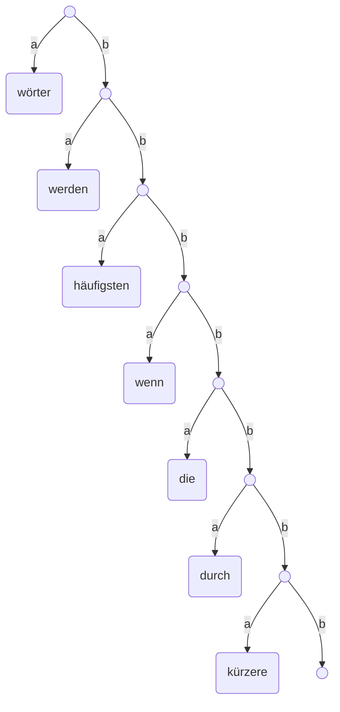

# SimpleZip

Ein einfaches Kompressionsprogramm für Textdateien.

Dieses Projekt soll demonstrieren, wie ein einfacher Kompressionsalgorithmus mit Hilfe
eines Tries funktionieren kann.

## Funktionsprinzip

### Kompression

- Durchsucht eine Textdatei und listet für jedes Wort auf, wie oft es vorkommt. 
- Jedem Wort wird eine Sequenz von Buchstaben zugeordnet, wobei die häufigsten Wörter
  die kürzesten Sequenzen bekommen.
  - Beispieltext:
  
      "Eine große Menge Wörter wird nicht kleiner, wenn die Wörter durch kürzere Wörter ersetzt werden. Besonders, wenn die häufigsten Wörter häufig durch kürzere Wörter ersetzt werden. Denn bei den häufigsten Wörtern werden dann auch am häufigsten Buchstaben gespart."
  - Wörter im Text und die zugehörigen Häufigkeiten und Sequenzen:

      Wort | Häufigkeit | Sequenz
      -------- | -------- | --------
      "wörter"   | 5   | "a"
      "werden"   | 3   | "ba"
      "häufigsten"   | 3   | "bba"
      "wenn"   | 2   | "bbba"
      "die"   | 2   | "bbbba"
      "durch"   | 2   | "bbbbba"
      "kürzere"   | 2   | "bbbbbba"

- Anschließend wird ein "Wörterbuch" aufgebaut, das eine Zuordnung der Sequenzen
  zu den Wörtern speichert.
  - Dieses Wörterbuch muss möglichst effizient zu durchsuchen sein.
    Ziel ist, dass der Dekompressionsprozess möglichst schnell geht.
  - Wir werden einen binären Trie verwenden, der die Sequenzen aus dem obigen Beispiel
    nach ihren gemeinsamen Präfixen gruppiert.
  - Das linke Kind jedes Knotens wird durch ein "a" erreicht und enthält das
    einzusetzende Wort. Die linken Kinder sind alle Blätter.
  - Die linken Kinder werden durch ein "b" erreicht und setzen die Sequenz fort.

- Der Trie für das obige Beispiel:

- Die komprimierte Datei ist eine Textdatei,
  bei der jedes Wort durch seine Sequenz ersetzt wurde.

## Dekompression

- Um einen Text zu entpacken, liest man die Sequenzen Wort für Wort ein.
- Bei jedem neuen Wort fängt man im Wörterbuch bei der Wurzel an und folgt den
  Verzweigungen. Erreicht man ein Blatt, schreibt man in den unkomprimierten Text
  das Wort, das man in diesem Knoten vorgefunden hat.
